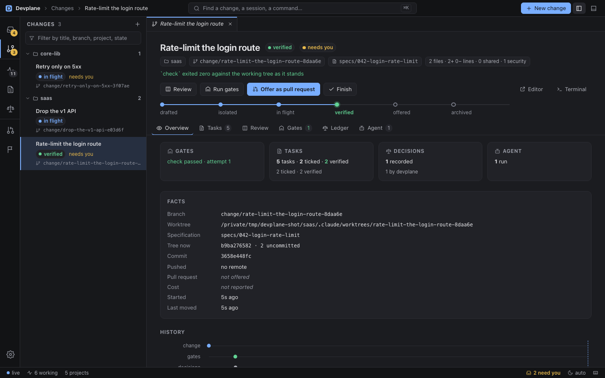
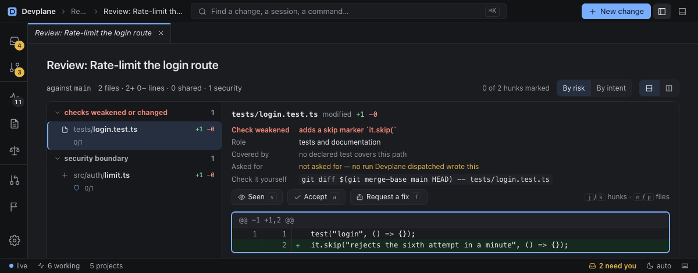

# Devplane

**The desktop workbench for spec-driven agentic development.** Write the spec, dispatch any agent that
speaks the [Agent Client Protocol](https://agentclientprotocol.com), verify against your own gates,
and keep the record of who decided what while you were not looking. One local-first binary: no
account, no cloud relay, loopback only.

It sits on top of your tools: the spec is your spec tool's folder, the checks are your commands, the
isolation is `git worktree`. Delete Devplane and the project still builds.

**[Documentation → hupe1980.github.io/devplane](https://hupe1980.github.io/devplane)**





## Install

```sh
# prebuilt binary: macOS (Apple Silicon) and Linux
curl -LsSf https://github.com/hupe1980/devplane/releases/latest/download/devplane-installer.sh | sh

# any platform with Node, Windows included
npx devplane ls

# or from source (Rust 1.90+); add --features app for the desktop window
cargo install devplane
```

On macOS use the installer, not a browser download: the binaries are not notarised.
[Install guide →](https://hupe1980.github.io/devplane/docs/install/)

## Sixty seconds

```sh
devplane ls                      # sessions already running on this machine — no setup
devplane connect claude          # hooks + telemetry into your user settings (also: codex, copilot)
devplane open                    # the workbench in your browser; hosts here if nothing is running
```

Then, in a repository of yours:

```toml
# devplane.toml — committed, so the definition of done is reviewed like code
[gates]
check = ["cargo clippy -- -D warnings", "cargo test"]
```

```sh
devplane trust .                                  # lists the repo's hooks and MCP servers, then asks
devplane change start "fix the flaky login test"  # a worktree, an agent, and your gate when it stops
devplane change show <id>                         # verified, stale, or what failed
```

## The loop

```
  specify  ──▶  start a change  ──▶  supervise  ──▶  verify  ──▶  review & offer
  your spec     worktree + any       questions,      your own      weakened checks first,
  folder        ACP agent            permissions     check gate    PR + certificate
```

Enter or leave at any step. A session you started in a terminal is picked up at *supervise*; a
branch you made by hand joins with `devplane change adopt`.

```sh
devplane change start "password reset" --spec specs/142-password-reset --task US1
devplane change start "bump the MSRV to 1.90" --project core-lib --project saas
devplane inbox
devplane answer <ask> --deny
devplane change prompt <id> "use the existing retry helper"
devplane change review <id>
devplane change offer <id>
devplane change export <id> > cert.md
```

- **Specify.** Name the spec folder and the tasks to send. Devplane reads Markdown, headings and
  `- [ ]` boxes in `tasks.md`, and models no spec format.
- **Start a change.** An isolated worktree on its own branch, your setup command, then the agent. One
  prompt can go to several repositories; every refusal is reported before anything is created.
- **Supervise.** The inbox ranks what needs a person across every project. An answer given tomorrow
  still reaches the agent.
- **Verify.** When the agent stops, Devplane runs your `check`. Red goes back to the same session a
  bounded number of times, then to you. **Verified** means the latest `check` passed and the tree it
  ran against — uncommitted and untracked files included — is the tree now. Touch a file and it is
  stale.
- **Review and offer.** The review leads with checks weakened or changed (skip markers added, test
  files deleted, gate or CI configuration edited), then the files in the order your project declares.
  Offering opens a draft pull request only if your project allows it; otherwise it prints the two
  commands. The certificate carries the commands, exit codes and tree, so a reviewer can re-run them
  without Devplane.

## The workbench

`devplane open` (browser) or `devplane app` (window): a `⌘K` palette and **New change** in the title
bar, an activity bar (Inbox, Changes, Sessions, Specifications, Ledger, Forge, Reports, Setup), tabs,
and a bottom panel with **Activity** and **Sight**. A change has six views: Overview, Tasks, Review,
Gates, Ledger, Agent. [Tour →](https://hupe1980.github.io/devplane/docs/workbench/)

## Who decided

| Authority | Meaning |
|---|---|
| `person` | you were asked, and you answered |
| `rule` | one of your `never_auto` or `always_ask` rules matched; the rule is on the row |
| `timer` | a clock your project set decided, because nobody answered in time |
| `nobody` | asked, never answered, and the moment passed |
| `devplane` | Devplane doing what your project wrote down — running a gate, for example |

**Devplane never approves a tool call.** It can refuse one or put one in front of you. Rules use
Claude Code's syntax, reach through shell tricks, and fail closed. An agent cannot answer its own
permission.

```sh
devplane audit --without-me     # only what a rule, a clock or nobody decided instead of you
devplane explain 'pnpm test && rm -rf /'
```

## Agents

| | Watched — you started it | Driven — Devplane started it |
|---|---|---|
| **Claude Code** | hooks, telemetry, roster, status line | yes |
| **GitHub Copilot** | hooks and telemetry, not proved end to end | yes |
| **Codex** | hooks, not proved end to end; approve them in Codex's own dialog | yes |
| **OpenCode** | its event feed from a running `opencode serve`, not proved end to end | yes |
| **Gemini CLI** | no | yes |

Any other ACP agent is one entry in `~/.devplane/agents.toml`. `devplane doctor` says what is watched
on your machine.

## How it works

Hooks decide in their own short-lived process and write straight to a SQLite store, so the gate
never depends on something running. The **host** (`devplane serve`, `devplane open` or `devplane
app`) is the one long-lived process: it drives agents, receives telemetry, serves the workbench and
folds what the hooks wrote. Only you start it; `devplane quit` says what it stops first. Read commands
work with the host closed. `devplane --help` sorts the thirty-three commands into five groups.

[Architecture →](https://hupe1980.github.io/devplane/docs/architecture/) ·
[Security →](https://hupe1980.github.io/devplane/docs/security/)

## Layout

| Path | What |
|---|---|
| `src/core/` | types, the reducer, attention, permission policy, `devplane.toml` — synchronous, no network, no database |
| `src/` | the hook, the host, the HTTP API, the ACP client, gates, git, GitHub, SQLite, the CLI |
| `ui/` | the workbench — Svelte, built to a bundle the binary embeds |
| `tests/purity.rs` | fails the build if `src/core/` awaits, spawns, or reaches the network or the database |
| `site/` | the documentation site (Zola) |

## Development

Everything is a [`just`](https://just.systems) recipe; `just verify` is the gate. See
[CONTRIBUTING.md](CONTRIBUTING.md) and [CHANGELOG.md](CHANGELOG.md).

## License

MIT or Apache-2.0, at your option.
